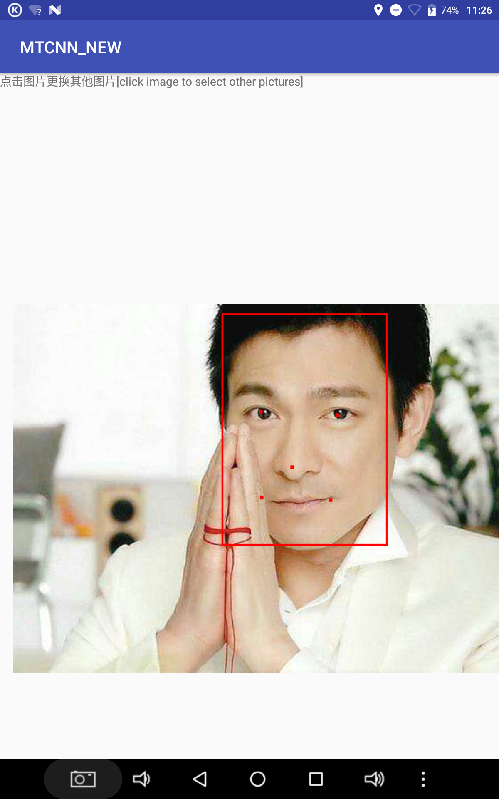
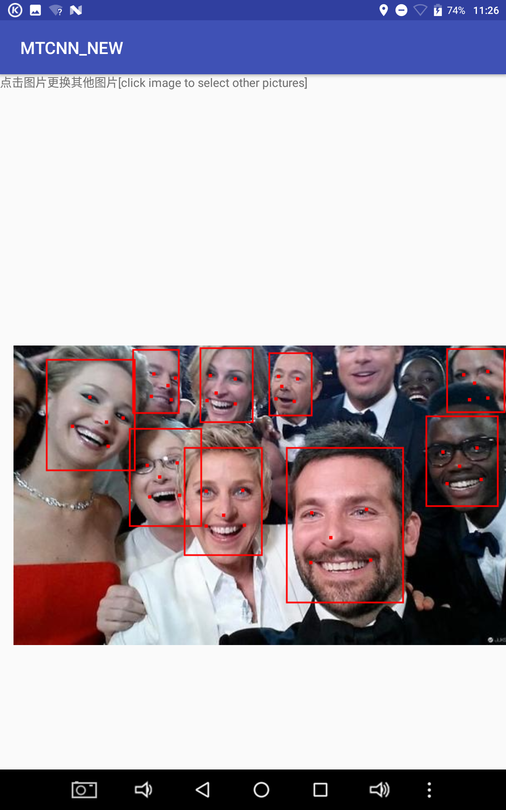

 # MTCNN4Android
MTCNN For Android Java 
<i> This project is the Android implementaion of MTCNN face detection. </i>
<i> I use the pretrained model in Google's Facenet project and transfrom the the .npy files into one .pb file first.</i> 

* IDE：Android Studio3.1.2
* Core Class MTCNN (see file MTCNN.Java) 
  * Get Instance : MTCNN mtcnn=new MTCNN(getAssets())
  * It is easy to use ,here is the core API:
    * <b> public Vector<Box> detectFaces(Bitmap bitmap,int minFaceSize) </b>
      * [parameter] bitmap : Image to process
      * [parameter] minFaceSize： minimum face size in pixels.(The speed will be faster when minFaceSize is bigger)
      * [Return Value]: Position of All faces(And their correspoinding facial landmarks(2*mouse+1*nose+2*eyes).
 
# MTCNN4Android 
MTCNN For Android Java 
<i>主要参考MTCNN论文和Facenet中MTCNN的实现，纯Java实现。为了方便java调用，我先把npy转为pb。</i>

* 编译环境：Android Studio3.1.2
* 核心类MTCNN用法 (MTCNN.Java)
  * 类实例化 MTCNN mtcnn=new MTCNN(getAssets())
  * 只有1个API：public Vector<Box> detectFaces(Bitmap bitmap,int minFaceSize)
    * 参数bitmap：要处理的图片
    * 参数minFaceSize：最小的脸像素值，一般>=40。越大则检测速度越快，但会忽略掉较小的脸
    * 返回值:所有的脸的Box，包括left/right/top/bottom/landmark(一共5个点，嘴巴鼻子眼) 
 
 
# Result ：
  
  
  
